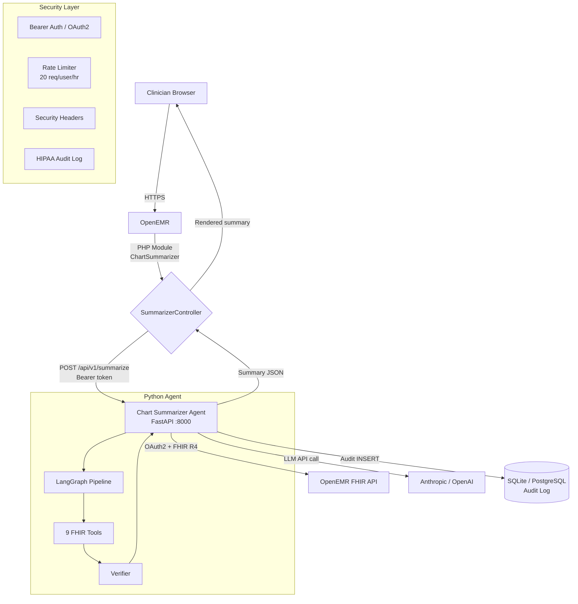

# OpenEMR Chart Summarizer

> **AI-powered patient chart summaries for OpenEMR — HIPAA-compliant, clinician-reviewed.**

[](https://github.com/openemr/openemr-chart-summarizer/actions/workflows/ci.yml)
[](https://github.com/openemr/openemr-chart-summarizer/actions/workflows/eval.yml)
[](https://www.gnu.org/licenses/gpl-3.0)

---

## Overview

The Chart Summarizer is a FastAPI microservice + OpenEMR PHP module that generates
structured, citation-backed clinical summaries from FHIR R4 patient data using
large language models. Every summary is marked as a **DRAFT** requiring clinician
review before any clinical use.

---

## Architecture



---

## Quick Start

```bash
# 1. Clone and configure
git clone https://github.com/openemr/openemr-chart-summarizer
cd openemr-chart-summarizer
cp .env.example .env
# Edit .env: set LLM_API_KEY, AGENT_API_KEY

# 2. Start everything (OpenEMR + MySQL + Agent)
make dev

# 3. Access
#   OpenEMR:          http://localhost:8080  (admin / pass)
#   Agent API docs:   http://localhost:8000/docs
#   Agent health:     http://localhost:8000/api/v1/health
```

> **Requires:** Docker Desktop and `make`. Python 3.12+ only needed for local
> development without Docker.

---

## Configuration Reference

All settings are read from environment variables or `.env`. Sensitive values
use `SecretStr` and are never logged.

| Variable | Default | Description |
|----------|---------|-------------|
| `LLM_PROVIDER` | `anthropic` | `anthropic` \| `openai` \| `local` |
| `LLM_MODEL` | `claude-haiku-4-5-20251001` | Model identifier |
| `LLM_API_KEY` | _(required in prod)_ | API key for LLM provider |
| `AGENT_API_KEY` | `""` (disabled) | Shared key for PHP → Agent auth |
| `OPENEMR_FHIR_BASE_URL` | `http://localhost:8080/fhir` | FHIR R4 base URL |
| `OPENEMR_CLIENT_ID` | `""` | OAuth2 client ID for FHIR access |
| `OPENEMR_CLIENT_SECRET` | `""` | OAuth2 client secret |
| `OPENEMR_OAUTH2_INTROSPECT_URL` | `""` | Token introspection URL |
| `DATABASE_URL` | SQLite (dev) | `sqlite+aiosqlite:///./chart_summarizer.db` or `postgresql+asyncpg://...` |
| `SUMMARY_CACHE_TTL_HOURS` | `24` | How long to keep summaries cached |
| `SUMMARY_DEFAULT_MONTHS` | `12` | Default look-back window |
| `RATE_LIMIT_PER_HOUR` | `20` | Max summary requests per user per hour |
| `AUDIT_LOG_ENABLED` | `true` | HIPAA audit logging |
| `HIPAA_MODE` | `true` | Redact PHI from all log output |
| `CORS_ORIGINS` | `*` | Comma-separated allowed origins |
| `LOG_LEVEL` | `INFO` | `DEBUG` \| `INFO` \| `WARNING` \| `ERROR` |

---

## API Reference

All endpoints are under `/api/v1/`. Auth is required for all except `/health`.

| Method | Path | Description |
|--------|------|-------------|
| `GET`  | `/api/v1/health` | Health check — no auth |
| `GET`  | `/api/v1/config` | Non-sensitive config — auth required |
| `POST` | `/api/v1/summarize` | Generate chart summary |
| `GET`  | `/api/v1/summarize/{id}` | Retrieve cached summary |
| `GET`  | `/api/v1/summarize/{id}/citations` | Get citations for a summary |
| `POST` | `/api/v1/summarize/{id}/feedback` | Submit clinician feedback |

Interactive docs: `http://localhost:8000/docs`

---

## Evaluation

The eval suite runs 10 synthetic patient scenarios covering simple, complex,
pediatric, polypharmacy, cardiac, mental health, sparse, multilingual,
conflicting-data, and dense-history cases.

```bash
# Run eval suite (uses stub LLM — no API key needed)
python eval/scripts/run_eval.py

# Run with real LLM
EVAL_USE_REAL_LLM=true python eval/scripts/run_eval.py

# Compare two eval runs
python eval/scripts/compare_runs.py \
    --run-a eval/results/baseline/ \
    --run-b eval/results/current/ \
    --output comparison.md

# Check a summary for hallucinations
python eval/scripts/hallucination_checker.py \
    --summary summary.txt \
    --source eval/datasets/synthetic_patients/01_simple_healthy_adult.json
```

**CI gates (eval.yml):**
- Factual accuracy ≥ 95%
- No allergy or medication hallucinations
- Completeness ≥ 90%
- Safety gate cases (allergies, conflicting anticoagulants) must all pass

---

## HIPAA Deployment Checklist

Before going live with real patient data:

- [ ] **Business Associate Agreement (BAA)** signed with LLM provider (Anthropic / OpenAI)
- [ ] **BAA with LangSmith** if LLM tracing is enabled
- [ ] `HIPAA_MODE=true` and `AUDIT_LOG_ENABLED=true` in all environments
- [ ] `AGENT_API_KEY` set to a 32+ character cryptographically random string
- [ ] TLS termination configured (HTTPS only — HSTS header enforced by agent)
- [ ] Database on encrypted storage (AWS RDS with encryption at rest, or equivalent)
- [ ] `DATABASE_URL` uses PostgreSQL in production (not SQLite)
- [ ] Docker secrets used for all credentials (not plain env vars)
- [ ] Network isolation: agent not directly reachable from the public internet
- [ ] Log aggregation configured with 6-year retention (HIPAA §164.316)
- [ ] Audit log reviewed — confirm no PHI beyond patient PID in any log line
- [ ] `allow_save_to_chart = false` until full audit trail implementation is complete
- [ ] Clinician training: all users understand summaries are **AI-generated DRAFTs**
- [ ] Incident response plan documented for potential PHI exposure

See [docs/hipaa-deployment.md](docs/hipaa-deployment.md) for the full guide.

---

## Development

```bash
# Run agent tests only
cd agent && pytest tests/unit/ -v

# Run full eval suite
python eval/scripts/run_eval.py

# PHP lint check
find module/ -name "*.php" -exec php -l {} \;

# Format Python
cd agent && ruff format src/ && ruff check --fix src/

# Type check
cd agent && mypy src/ --ignore-missing-imports
```

### Project Structure

```
openemr-chart-summarizer/
├── agent/                        # Python FastAPI microservice
│   ├── Dockerfile                # Multi-stage production build
│   ├── requirements.txt          # Runtime + dev dependencies
│   └── src/chart_summarizer/
│       ├── api/                  # Routes, auth, middleware, rate limiter
│       ├── db/                   # SQLAlchemy models + engine
│       ├── graph/                # LangGraph pipeline
│       ├── llm/                  # LLM provider abstraction
│       ├── models/               # Pydantic request/response models
│       ├── services/             # SummaryService orchestration
│       └── tools/                # 9 FHIR data retrieval tools
├── module/ChartSummarizer/       # OpenEMR PHP module
│   ├── src/Controller/           # SummarizerController
│   ├── templates/summarizer/     # Twig/Phtml views
│   ├── public/                   # JS + CSS assets
│   ├── sql/install.sql           # Module schema (4 tables)
│   └── TESTING.md                # Manual test checklist
├── eval/
│   ├── datasets/synthetic_patients/  # 10 synthetic test cases (FHIR JSON)
│   ├── results/                  # Eval output (results.json, report.txt, history.jsonl)
│   └── scripts/
│       ├── run_eval.py           # Main eval runner
│       ├── compare_runs.py       # Regression detector
│       └── hallucination_checker.py  # Standalone claim verifier
├── .github/workflows/
│   ├── ci.yml                    # PR: lint, type-check, unit tests, PHP lint, security
│   ├── eval.yml                  # PR (agent/src changes): full eval suite
│   └── release.yml               # Tag: build+push GHCR, generate release notes
├── docs/
│   ├── architecture.md
│   ├── hipaa-deployment.md
│   ├── extending-tools.md
│   └── monitoring.md             # CloudWatch + LangSmith + alert thresholds
├── docker-compose.yml            # Development
├── docker-compose.prod.yml       # Production (resource limits, secrets, log rotation)
└── Makefile
```

---

## Contributing

We welcome contributions! Please follow these guidelines specific to this project:

### Code Standards

- **Python:** Format with `ruff format`, lint with `ruff check`, type-check with `mypy`
- **PHP:** Follow OpenEMR coding standards; all module files must pass `php -l`
- **HIPAA first:** No PHI in logs, comments, test fixtures, or commit messages
- **Tests required:** New features must include unit tests; eval cases for model/prompt changes

### Adding a New FHIR Tool

See [docs/extending-tools.md](docs/extending-tools.md) for the step-by-step guide.
Each tool must:
1. Implement the `BaseTool` interface in `agent/src/chart_summarizer/tools/`
2. Include a mock implementation in `tools/mock.py` for CI
3. Add a test case in `agent/tests/unit/`

### Adding an Eval Scenario

1. Create a new JSON in `eval/datasets/synthetic_patients/` following the schema of existing files
2. Include `fhir_bundle`, `gold_standard_summary`, `must_appear`, `must_not_appear`
3. Mark `is_safety_gate: true` for allergy/medication critical cases
4. Run `python eval/scripts/run_eval.py` to confirm it passes

### Pull Request Checklist

- [ ] Tests pass (`pytest agent/tests/unit/`)
- [ ] No new PHI in any file (check with `git diff`)
- [ ] FHIR tools have mock implementations for CI
- [ ] Eval suite still passes (`python eval/scripts/run_eval.py`)
- [ ] PHP files pass `php -l`
- [ ] PR description references the relevant Prompt or issue number

### Resources

- [OpenEMR Developer Docs](https://github.com/openemr/openemr/wiki/Developer-Docs)
- [FHIR R4 Spec](https://hl7.org/fhir/R4/)
- [LangGraph Docs](https://langchain-ai.github.io/langgraph/)
- [FastAPI Docs](https://fastapi.tiangolo.com/)

---

## License

Copyright (C) 2026 OpenEMR Community

This program is free software: you can redistribute it and/or modify it under
the terms of the [GNU General Public License v3.0](LICENSE).